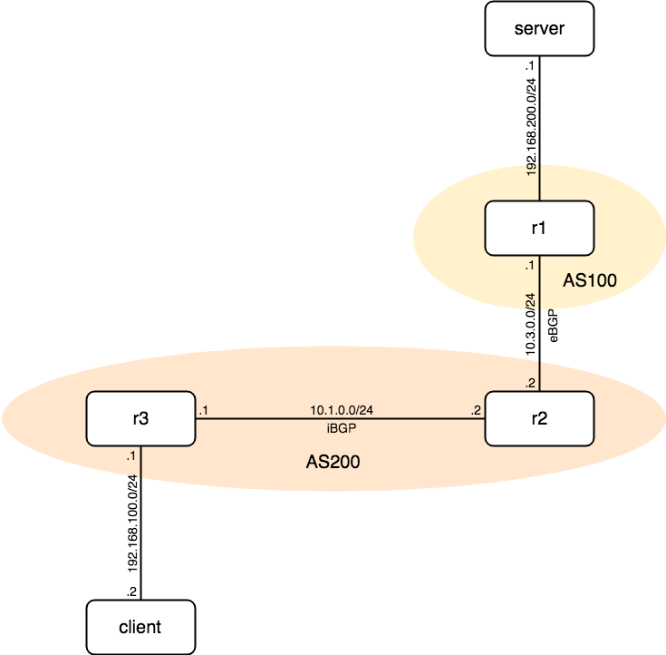

# Practice of BGP and OSPF

とある理由のネットワークのお勉強

## 構築手順

- quaggaという名前のLXDベースイメージを作成
- setup.shを実行
- test1.shを実行
	- test1.sh: 全リンクのそれぞれの到達性を確認
- 妥協: r2,r3,r5に入って地道にquaggaをコンフィグ
	- 目標: r0-r6に入って地道にquaggaをコンフィグ
- client/server間でping

## 撤収手順

- shutdown.shを実行

## Quaggaのコンフィグ例

```
$ cat /etc/quagga/bgpd.conf
...
router bgp 100
 bgp router-id 3.3.3.3
 neighbor 10.9.0.1 remote-as 500
 neighbor 10.4.0.2 remote-as 200
...
```

## References

- https://github.com/vishvananda/netns
- https://github.com/redhat-nfvpe/koko
- http://wiki.slankdev.net/misc/lxd
- http://wiki.slankdev.net/misc/quagga

構築する仮想NWのtopo図



